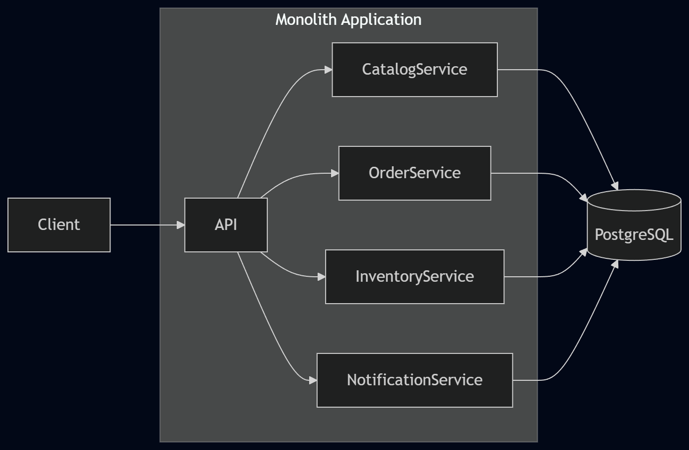
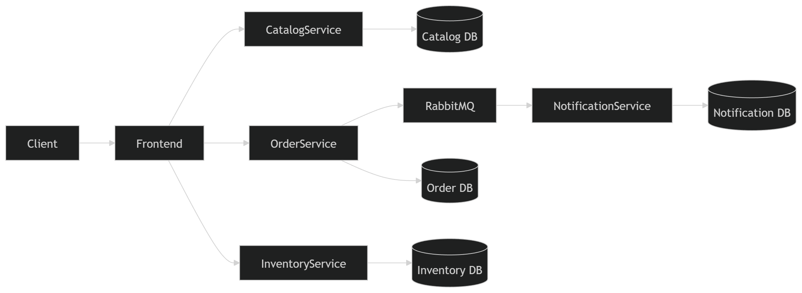

# 📸 SuiLens: Platform Penyewaan Peralatan Studio
**CSCE604271 – Arsitektur Aplikasi Web | Assignment 1 (Monolitik vs Mikroservis)**

---

## 👨‍🎓 Identitas Mahasiswa
- **Nama** : Darryl Abysha Artapradana Subiyanto
- **NPM** : 2206082846
- **Program Studi** : Sistem Informasi, Fakultas Ilmu Komputer Universitas Indonesia

---

## 📁 Struktur Direktori
Sesuai dengan spesifikasi tugas, repositori ini memuat dua versi arsitektur dari aplikasi SuiLens:
#### 1. `/suilens-monolith`: 
Berisi aplikasi SuiLens dengan arsitektur Monolitik (semua modul dalam satu proses dan satu database).

```text
suilens-monolith
├── src
├── docker-compose.yml
└── package.json
```

**Architecture**:


**Karakteristik**:
- satu aplikasi backend
- satu database
- komunikasi internal menggunakan function call
- transaksi database ACID

#### 2. `/suilens-microservice`: 
Berisi aplikasi SuiLens dengan arsitektur Mikroservis (layanan Catalog, Order, Inventory, dan Notification terpisah dengan database masing-masing).

```text
suilens-microservice
├── src
│   ├── catalog-service
│   ├── inventory-service
│   ├── notification-service
│   └── order-service
└── docker-compose.yml
```

**Architecture**:


**Karakteristik**:
- setiap service memiliki database sendiri
- komunikasi menggunakan HTTP dan event messaging
- service dapat di-scale secara independen

---

## 📖 Penjelasan Implementasi Singkat
Platform SuiLens dikembangkan untuk mendemonstrasikan perbedaan antara arsitektur Monolitik dan Mikroservis menggunakan tumpukan teknologi modern:
- **Frontend:** Menggunakan Vue 3 (Composition API) dan Vuetify 3 untuk komponen UI, serta TanStack Query untuk manajemen *server state*.
- **Backend:** Dibangun di atas ElysiaJS (dengan *runtime* Bun) yang menggunakan TypeScript secara *native*.
- **Database:** PostgreSQL 16 dengan Drizzle ORM untuk manajemen skema dan relasi.
- **Message Broker:** RabbitMQ 3.13 digunakan khusus pada arsitektur mikroservis untuk komunikasi asinkron (misalnya, *event* pembuatan dan pembatalan pesanan).
- **Infrastruktur:** Seluruh layanan diorkestrasi menggunakan Docker Compose.

---

## 🚀 Cara Menjalankan Sistem

Seluruh sistem dikonfigurasi agar dapat dijalankan menggunakan satu perintah Docker, mencakup migrasi database dan proses seeding.

### 1. Menjalankan Monolitik
```bash
cd suilens-monolith
docker compose up --build -d
```
Akses API di http://localhost:3000.


### 2. Menjalankan Mikroservice
```bash
cd suilens-microservice
docker compose up --build -d
```
#### Akses layanan:
- Frontend UI: http://localhost:5173
- Catalog API: http://localhost:3001
- Order API: http://localhost:3002
- Inventory API: http://localhost:3003

---

## 🧪 Testing Guide

Berikut adalah skenario pengujian cepat menggunakan **cURL** untuk memvalidasi alur kerja sistem pada masing-masing arsitektur.

---

# A. Skenario Pengujian Monolitik (Port 3000)

Pada arsitektur **monolitik**, seluruh endpoint diakses melalui satu layanan terpusat:

```
http://localhost:3000
```

Semua modul (Catalog, Inventory, dan Order) berjalan dalam satu aplikasi yang sama.

---

## 1. Cek Ketersediaan Stok Lensa (Contoh: Leica)

```bash
LENS_ID=$(curl -s http://localhost:3000/api/lenses | jq -r '.[0].id')

curl http://localhost:3000/api/inventory/lenses/$LENS_ID | jq
```

**Ekspektasi**

- Sistem menampilkan jumlah stok lensa yang tersedia di berbagai cabang.

---

## 2. Membuat Pesanan (Reservasi Stok Transaksional)

```bash
curl -X POST http://localhost:3000/api/orders \
  -H "Content-Type: application/json" \
  -d '{
    "customerName": "Darryl",
    "customerEmail": "darryl@example.com",
    "lensId": "'"$LENS_ID"'",
    "branchCode": "KB-JKT-S",
    "startDate": "2026-03-10",
    "endDate": "2026-03-15"
  }' | jq
```

**Ekspektasi**

- Response **201 Created**
- Pesanan berhasil dibuat
- Stok langsung berkurang dalam **satu transaksi database (ACID)**

---

## 3. Membatalkan Pesanan (Stok Kembali)

```bash
# Ganti <ORDER_ID> dengan ID pesanan dari langkah sebelumnya
curl -X PATCH http://localhost:3000/api/orders/<ORDER_ID>/cancel | jq
```

**Ekspektasi**

- Status pesanan berubah menjadi `cancelled`
- Stok lensa otomatis bertambah kembali

---

# B. Skenario Pengujian Mikroservis (Multi-Port)

Pada arsitektur **mikroservis**, setiap layanan memiliki API dan port masing-masing.

| Service | Port |
|--------|------|
| Catalog Service | 3001 |
| Order Service | 3002 |
| Inventory Service | 3003 |

---

## 1. Cek Ketersediaan Stok Lensa

Mengambil data lensa dari **Catalog Service**, lalu mengecek stok di **Inventory Service**.

```bash
# Mengambil ID dari Catalog Service
LENS_ID=$(curl -s http://localhost:3001/api/lenses | jq -r '.[0].id')

# Mengecek stok di Inventory Service
curl http://localhost:3003/api/inventory/lenses/$LENS_ID | jq
```

**Ekspektasi**

- Sistem menampilkan stok lensa pada cabang **KB-JKT-S**.

---

## 2. Membuat Pesanan (Reservasi Stok)

Order dibuat melalui **Order Service**, yang kemudian akan memanggil **Inventory Service** untuk reservasi stok.

```bash
curl -X POST http://localhost:3002/api/orders \
  -H "Content-Type: application/json" \
  -d '{
    "customerName": "Darryl",
    "customerEmail": "darryl@example.com",
    "lensId": "'"$LENS_ID"'",
    "branchCode": "KB-JKT-S",
    "startDate": "2026-03-10",
    "endDate": "2026-03-15"
  }' | jq
```

**Ekspektasi**

- Response **201 Created**
- Order Service melakukan reservasi stok ke Inventory Service secara **sinkron**

---

## 3. Membatalkan Pesanan (Compensating Action)

```bash
# Ganti <ORDER_ID> dengan ID pesanan dari langkah sebelumnya
curl -X PATCH http://localhost:3002/api/orders/<ORDER_ID>/cancel | jq
```

**Ekspektasi**

- Status pesanan berubah menjadi `cancelled`
- Event dikirim ke **RabbitMQ**
- Inventory Service akan menambah stok kembali secara **asinkron (idempotent)**

--- 

## 📡 API Documentation (Kontrak Minimum)

| Layanan   | Method | Endpoint                         | Deskripsi |
|-----------|--------|----------------------------------|-----------|
| Catalog   | GET    | `/api/lenses`                    | Mendapatkan daftar seluruh lensa beserta spesifikasinya. |
| Inventory | GET    | `/api/inventory/lenses/:lensId`  | Membaca stok lensa yang tersedia di seluruh cabang. |
| Inventory | POST   | `/api/inventory/reserve`         | Endpoint internal untuk reservasi stok oleh Order Service. |
| Order     | POST   | `/api/orders`                    | Membuat pesanan baru dan mereservasi stok. |
| Order     | PATCH  | `/api/orders/:id/cancel`         | Membatalkan pesanan (memicu pengembalian stok via event). |

---

## ⚙️ Asumsi Implementasi
Dalam pengembangan sistem ini, beberapa asumsi diterapkan:
1. **Hardcoded UUID pada Seeder:** Untuk memastikan konsistensi relasi data antar layanan yang databasenya terisolasi (khususnya antara `Catalog Service` dan `Inventory Service`), *ID* lensa menggunakan UUID statis pada saat proses *seeding* awal.
2. **Idempotensi RabbitMQ:** Proses kompensasi (pengembalian stok) pada `Inventory Service` dirancang bersifat *idempotent* menggunakan pencatatan ID event, sehingga pemrosesan pesan pembatalan ganda dari RabbitMQ tidak akan melipatgandakan stok secara keliru.
3. **Komunikasi Klien ke Layanan:** Aplikasi frontend berkomunikasi langsung dengan *port* masing-masing layanan mikroservis tanpa menggunakan *API Gateway* karena implementasi *reverse proxy* (seperti Nginx/Traefik) diasumsikan sebagai tantangan opsional pada tugas ini.

---

## 🤖 Disclosure Penggunaan AI
Dalam menyelesaikan tugas ini, saya menggunakan bantuan *Generative AI* (seperti Google Gemini dan ChatGPT) untuk hal-hal berikut:
- Melakukan pembelajaran komponen UI *Frontend* menggunakan Vue 3 dan Vuetify (seperti untuk merapikan tata letak *grid*).
- Menemukan solusi *cache invalidation* pada TanStack Vue Query (`queryClient.invalidateQueries`) untuk memicu pembaruan data stok secara *real-time* setelah pesanan berhasil dibuat.
- Menghasilkan representasi kode *Mermaid.js* untuk merender diagram arsitektur.

---

## 📊 Analisis Perbandingan (D2)

### (a) Skenario Keunggulan Mikroservis (Tangguh terhadap Kegagalan)
Arsitektur mikroservis memiliki keunggulan dalam hal isolasi kesalahan. Sebagai contoh, jika Notification Service mengalami crash akibat gangguan server SMTP, srrvice Catalog, Inventory, dan Order tetap berjalan normal. Pelanggan masih dapat membuat pesanan, dan event notifikasi akan mengantre di RabbitMQ secara asinkron hingga layanan notifikasi kembali aktif. Pada sistem monolitik, kegagalan pada modul notifikasi dapat mematikan seluruh proses aplikasi.

### (b) Skenario Keunggulan Monolitik (Kesederhanaan & Integritas)
Sistem monolitik jauh lebih sederhana dan memiliki jaminan kebenaran yang lebih tinggi terkait integritas transaksional. Proses pembuatan pesanan—verifikasi harga, pemotongan stok, pencatatan pesanan, dan pembuatan notifikasi—semuanya dibungkus dalam satu transaksi database tunggal. Jika terjadi kegagalan di langkah mana pun, sistem secara otomatis melakukan rollback tanpa meninggalkan inkonsistensi data. Tidak diperlukan mekanisme rumit seperti compensating actions seperti pada mikroservis.

### (c) Skenario Kegagalan Inventory Service Saat Pemesanan
Pada arsitektur mikroservis ini, Order Service memanggil Inventory Service secara sinkron (HTTP) saat membuat pesanan. Jika Inventory Service sedang down, pemanggilan tersebut akan mengalami timeout atau ditolak, sehingga pesanan gagal dibuat. *Sebagai mitigasi, dapat diterapkan pola untuk menggagalkan request dengan cepat tanpa membebani layanan, atau mengubah alur reservasi menjadi asinkron di mana pesanan awalnya berstatus `PENDING` dan dikonfirmasi nanti saat inventaris pulih.

### (d) Trade-off dan Pendekatan Alternatif
Trade-off terbesar yang saya buat pada tugas ini adalah menggunakan pola komunikasi campuran: pemanggilan sinkron untuk memverifikasi dan mereservasi stok, namun menggunakan asinkron (RabbitMQ) untuk aksi kompensasi saat pembatalan. Pilihan ini mengorbankan sebagian ketahanan sistem (karena Order Service menjadi coupled secara temporal dengan Inventory) demi menjaga pengalaman pengguna yang segera tahu apakah stok lensa benar-benar ada. 

Pendekatan alternatifnya adalah menerapkan Event-Carried State Transfer penuh. Order Service dapat mendengarkan event perubahan dari Inventory Service dan menyimpan read-replica jumlah ketersediaan stok lokal di databasenya sendiri. Dengan pendekatan alternatif ini, Order Service tidak perlu melakukan HTTP call sama sekali ke Inventory Service saat checkout, sehingga menghilangkan titik kegagalan tersebut sepenuhnya.

---

## 📝 Penilaian Mandiri (Jawaban Pertanyaan Tutorial)

**1. Mengapa Order Service tidak bisa langsung query tabel lenses dalam versi mikroservis?**
Dalam arsitektur mikroservis, setiap layanan menerapkan pola *Database-per-Service*. Hal ini dilakukan untuk memastikan *loose coupling* (ketergantungan yang longgar) dan isolasi data. Jika Order Service membaca langsung ke database Catalog Service (*database integration*), maka struktur tabel lenses menjadi kontrak publik. Jika tim Catalog mengubah skema tabelnya (misalnya mengganti nama kolom), Order Service akan langsung *error*. Dengan memaksa layanan untuk berkomunikasi melalui API, masing-masing tim memiliki otonomi penuh untuk mengubah struktur database internal mereka tanpa memengaruhi layanan lain.

**2. Apa yang terjadi pada event di RabbitMQ jika tidak ada consumer yang berjalan? Apa yang terjadi ketika consumer mulai berjalan lagi?**
Ini adalah keunggulan utama dari komunikasi asinkron berbasis *message broker*. Saat tidak ada *consumer*: Pesan (*event*) tidak akan hilang. RabbitMQ akan menyimpannya dengan aman di dalam *Queue* (antrean) selama antrean tersebut dikonfigurasi sebagai *durable* (tahan lama). Pesan-pesan tersebut hanya akan "menumpuk" dan menunggu. Saat *consumer* berjalan lagi: *Consumer* (misalnya Notification Service) akan langsung mengambil pesan-pesan yang tertunda tersebut secara berurutan (FIFO) dan memprosesnya seolah-olah tidak terjadi apa-apa. Ini memberikan isolasi kesalahan dan toleransi kegagalan yang sangat tinggi.

**3. Mengapa kita menyimpan `lensSnapshot` di record pesanan alih-alih memanggil Catalog Service setiap kali membutuhkan detail lensa?**
Pendekatan ini menggunakan teknik Denormalisasi Data/Duplikasi Data karena dua alasan fundamental:
- **Akurasi Historis:** Harga dan spesifikasi lensa bisa berubah sewaktu-waktu (misal harga sewa naik bulan depan). Jika Anda hanya menyimpan `lensId` dan melakukan query ke Katalog saat melihat riwayat pesanan tahun lalu, harga yang muncul adalah harga hari ini, bukan harga pada saat pesanan dibuat. Snapshot membekukan fakta pada saat kejadian.
- **Kemandirian & Kinerja:** Dengan memiliki snapshot, Order Service menjadi layanan yang mandiri (*self-contained*). Jika Catalog Service sedang *down*, pengguna tetap dapat melihat detail pesanan mereka dengan lancar.

**4. Dalam monolit, pembuatan pesanan + notifikasi adalah satu transaksi atomik. Dalam mikroservis, tidak demikian. Apa yang bisa salah?**
Tanpa jaminan transaksi ACID di level *database* tunggal, Anda dihadapkan pada masalah *Partial Failure* (kegagalan sebagian) dalam sistem terdistribusi. Skenario yang bisa salah: Order Service berhasil menyimpan data pesanan di databasenya sendiri, namun tepat sebelum ia mempublikasikan event ke RabbitMQ, Order Service *crash* atau jaringan terputus. Akibatnya: Pesanan tercatat di sistem, tetapi notifikasi tidak pernah terkirim. Data menjadi inkonsisten.

**5. Mengapa pemanggilan Katalog → Pesanan bersifat sinkron tetapi pemanggilan Pesanan → Notifikasi bersifat asinkron? Bisakah sebaliknya?**
Keputusan sinkron vs asinkron bergantung pada kebutuhan alur kerja bisnis:
- **Mengapa Katalog sinkron?** Order Service mutlak membutuhkan informasi dari Katalog (validasi stok/harga) sebelum ia bisa memproses pembuatan pesanan. Tanpa data tersebut, proses bisnis tidak bisa dilanjutkan.
- **Mengapa Notifikasi asinkron?** Mengirim email hanyalah efek samping. Pengguna tidak perlu menunggu respons dari server email SMTP agar layar mereka menampilkan tulisan "Pesanan Berhasil".
- **Bisakah sebaliknya?** Sangat buruk jika dibalik. Jika Katalog asinkron, sistem mungkin membiarkan pengguna memesan lensa yang ternyata tidak ada stoknya (*eventual consistency* yang tidak pada tempatnya). Jika Notifikasi sinkron, Order Service akan berjalan lambat karena menunggu email terkirim, dan jika layanan email mati, proses pembuatan pesanan pengguna akan ikut gagal (*cascading failure*).